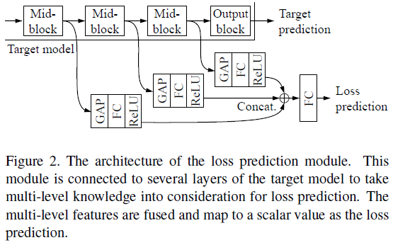
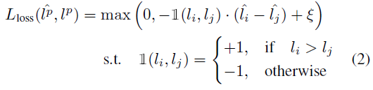
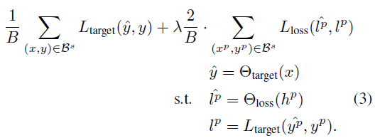

# Learning Loss for Active Learning (CVPR'19)

All assets are from authors' paper

## Easy implementation of LPM, Proposed loss function
 
### LPM (loss prediction module)
 

    

### Learning loss

    

 

    

